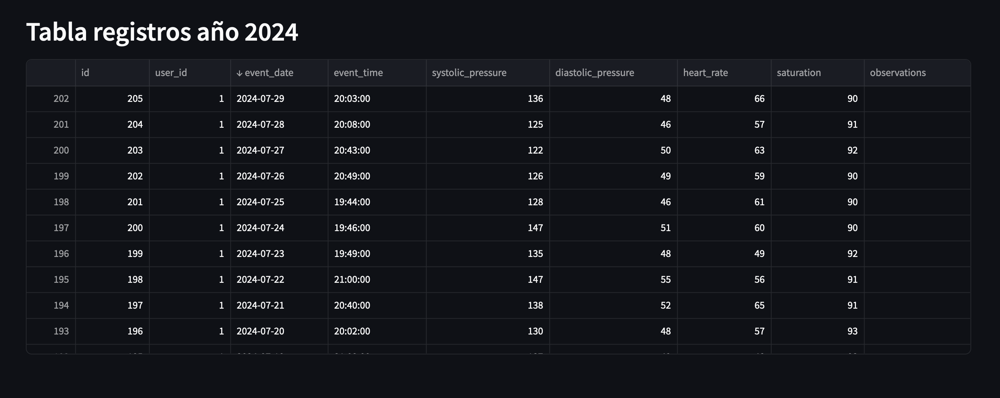

# Sistema de Monitoreo de Salud

## Descripción
Tomando los datos de los pacientes recolectados en el proyecto https://github.com/SantiagoCerqu/presion_arterial_web, aqui se presentan en un dashboard para visualización. La aplicación permite a los usuarios conectarse y consultar los datos en tiempo real.

## Características
- Recolección de datos biométricos de pacientes.
- Dashboard interactivo para la visualización de datos.
- Conexión mediante enlaces para acceder a la base de datos.

## Tecnologías Utilizadas
- Python
- PostgreSQL
- Plotly

## Instalación
1. Clona este repositorio.
   ```bash
   git clone https://github.com/usuario/presion_arterial_visualizacion.git

## Imagenes



